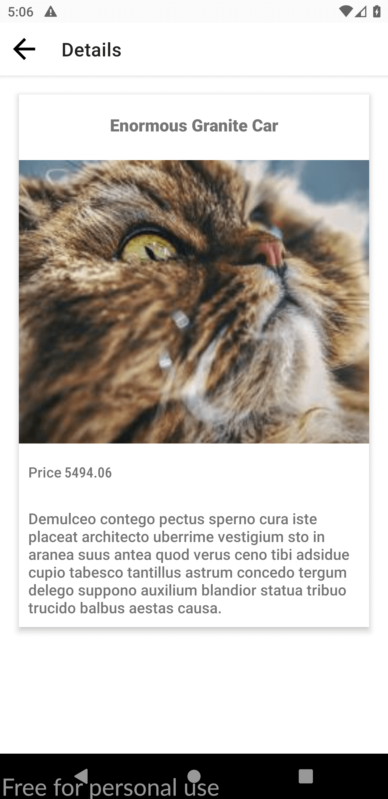
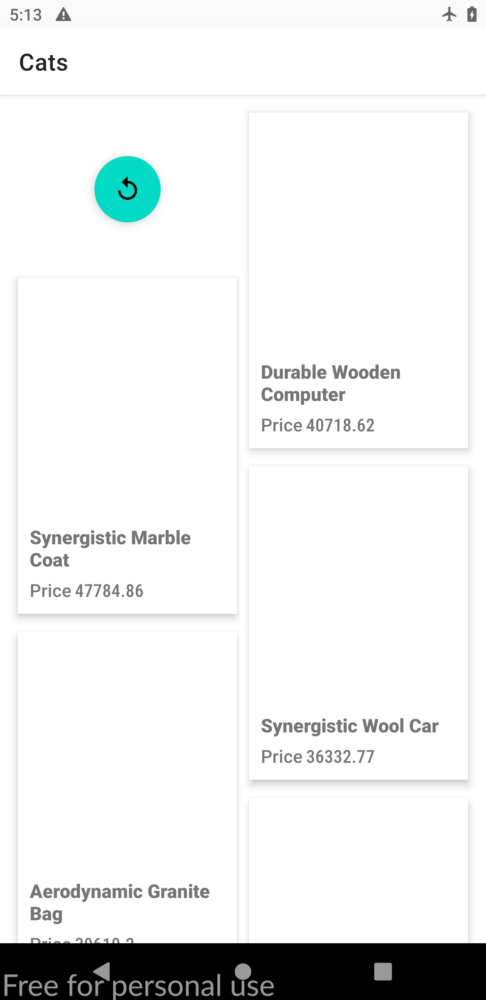

Example of RxJava with MVP architecture
=================

This project is a example of how to implement the MVP architecture with RxJava in kotlin.

Libraries Used
--------------

* [RxJava][0] - RxJava is a Java VM implementation of Reactive Extensions: a library for composing asynchronous and event-based programs by using observable sequences.
* [RxAndroid][1] - This module adds the minimum classes to RxJava that make writing reactive components in Android applications easy and hassle-free. More specifically, it provides a Scheduler that schedules on the main thread or any given Looper.
* [RxKotlin][2] - RxKotlin is a lightweight library that adds convenient extension functions to RxJava.
* [Paging v3][3] - The Paging library helps you load and display pages of data from a larger dataset from local storage or over network.
* [Dagger 2][4] -Dagger is a fully static, compile-time dependency injection framework for both Java and Android.

[0]: https://github.com/ReactiveX/RxJava
[1]: https://github.com/ReactiveX/RxAndroid
[2]: https://github.com/ReactiveX/RxKotlin
[3]: https://developer.android.com/topic/libraries/architecture/paging/v3-overview
[4]: https://dagger.dev/

Screenshots
-----------

License
-------

Copyright 2021 Aria rostami farah

Licensed under the Apache License, Version 2.0 (the "License");
you may not use this file except in compliance with the License.
You may obtain a copy of the License at

    http://www.apache.org/licenses/LICENSE-2.0

Unless required by applicable law or agreed to in writing, software
distributed under the License is distributed on an "AS IS" BASIS,
WITHOUT WARRANTIES OR CONDITIONS OF ANY KIND, either express or implied.
See the License for the specific language governing permissions and
limitations under the License.

